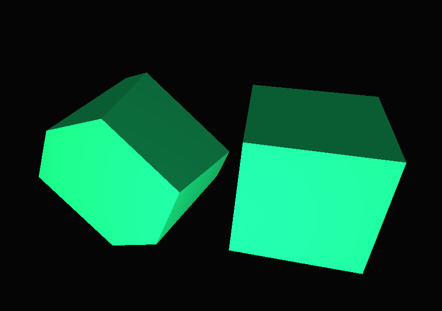

# OSE
Oversimplified engine (OpenGL C++)
## Description
A simple engine designed for 4D rendering.
## Examples
Rendering two hypercubes


# Build
CMake targets:
- OSE - Engine dynamic library
- SandboxBundle - sandbox executable for testing
## Build options
- OSE_DISABLE_LOGGING - disable logging (default ON)
- S_APP_NAME=App - define app name (default "APP")
# Setup
## Using Sandbox project
- Clone this repository
- Put your code into __./Sandbox/src__
- Build target **SandboxBundle**
## Custom setup
OSE is designed as dynamic library
- Build library
- Include **OSE.h**
- Inherit from **Engine**
```
class ExamapleGame : public OSE::Engine {
    // Use constructor for initialization
    ExamapleGame() {
        //create player and so on
    }
};
```
- Define **CreateApplication** callback
```
OSE::Engine* OSE::CreateApplication() {
	return new ExamapleGame();
}
```
- Do **not** define/declare entry point ("main" function), it is already defined in OSE.h
- See [Sandbox.cpp](Sandbox/src/Sandbox.cpp) for more examples
- Use __bundle(target relative_path_to_assets)__ CMake function to add custom target for building final application
# Essential docs
## Events
```OSE::EventListener``` - template class, inherite from it to subsribe for events
```
class Player : public OSE::EventListener<OSE::KeyPressedEvent> {
    void onEvent(OSE::KeyPressedEvent& ev) override {
        OSE_LOG(LOG_APP_TRACE, ev.getKeyCode());
    }
}
```

```OSE::TickEvent``` - event type for tick events: fired each update ~ each frame.

```OSE::RenderEvent``` - event called each frame to render entites. Perform all rendering on receive.
```
void onRender(OSE::Renderer* renderer) override {
    renderer->drawStaticMesh(OSE::AssetSystem::instance->getStaticMesh("cube") , &this->getTransform());
}
```

```OSE::Actor``` - base class of in-game entities. If something is intended as a dynamic entity it should inherit from this class. ```OSE::Actor``` will receive __Tick Events__ by default.

```OSE::AssetSystem``` - class for loading assets from files, is a singleton instance. Never throws! Returns nullptr if failed.
```
OSE::AssetSystem::instance->setAssetDir("assets/");
if (!OSE::AssetSystem::instance->loadStaticMesh("cube", "cube.obj")) {
    OSE_LOG(LOG_APP_WARNING, "Failed to load asset");
}
```
